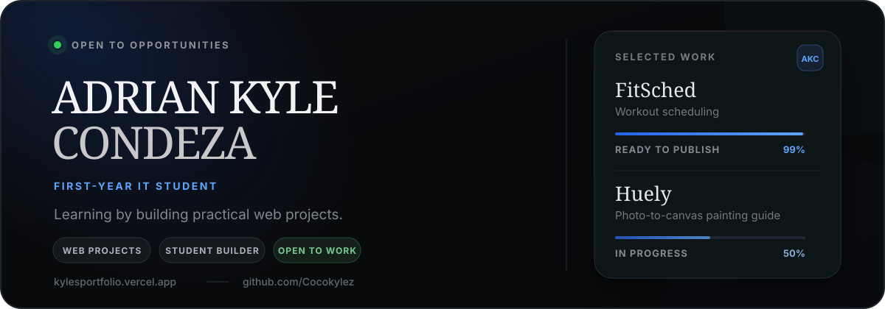

<p align="center">
  
</p>

<p align="center">
  <a href="https://kylesportfolio.vercel.app/"><strong>View Portfolio</strong></a>
  &nbsp;·&nbsp;
  <a href="#selected-work">Selected Work</a>
  &nbsp;·&nbsp;
  <a href="mailto:kuyag100621@gmail.com">Contact</a>
</p>

<p align="center">
  
  
  
  
  
</p>

## A portfolio built around real work

I am **Adrian Kyle Condeza**, a first-year Information Technology student. I learn best by building, and this is where I share what I am working on.

The portfolio brings together my projects, growing skills, and current tools. The design stays simple so the work remains the focus.

> [!TIP]
> Visit **[kylesportfolio.vercel.app](https://kylesportfolio.vercel.app/)** for the interactive version, including animated cards, project progress, and the full tools panel.

## Selected work

| Project | Status | What it does |
| --- | --- | --- |
| **[FitSched](https://fitsched.vercel.app/)** | Ready to publish · **99%** | A workout scheduler that syncs with Google Calendar and fits training into the time you actually have. |
| **[Huely](https://huely.vercel.app/)** | In progress · **50%** | Turns a photo into a practical painting reference with canvas tools, an extracted palette, and realistic color-mixing guidance. |

## What is inside

- A responsive single-page layout for desktop and mobile.
- Interactive project cards and an expandable tools panel.
- Current progress updates for FitSched and Huely.
- A deployed contact form powered by a Vercel function and Resend.
- Reduced-motion support for visitors who prefer it.

## Portfolio stack

| Area | Built with |
| --- | --- |
| Interface | React 18, JavaScript, HTML, and CSS |
| Styling | Tailwind CSS 3 and custom responsive styles |
| Motion | Framer Motion 11 |
| Development | Vite 5 |
| Contact delivery | Vercel Functions and Resend |
| Hosting | Vercel |

## Skills and tools

**Skills shown in the portfolio:** HTML, CSS, JavaScript, TypeScript, Java, Next.js, Tailwind CSS, and Supabase.

**This site is built with:** React, Vite, Tailwind CSS, Framer Motion, and Resend.

**Tools I currently use:** VS Code, Cursor, Google Antigravity, ChatGPT, Codex, Claude Code, GitHub, and Microsoft Office.

## Run locally

### Requirements

- Node.js 18 or newer
- npm

### Start the portfolio

```bash
git clone https://github.com/Cocokylez/reportfolio.git
cd reportfolio
npm install
npm run dev
```

Open the local address shown by Vite, usually [http://localhost:5173](http://localhost:5173).

### Production build

```bash
npm run build
npm run preview
```

The regular Vite development server previews the interface only. The contact endpoint runs in a Vercel-compatible environment and does not run through plain `npm run dev`.

For the deployed contact form, add this environment variable to the Vercel project:

```env
RESEND_API_KEY=your_resend_api_key
```

## Project map

```text
api/contact.js           Contact form endpoint for Vercel
public/brand-icons/      Self-hosted tool and product marks
src/components/          Portfolio sections and interactions
src/App.jsx              Page composition
src/index.css            Global styling and shared UI rules
tailwind.config.js       Tailwind theme and animations
vite.config.js           Vite configuration
vercel.json              Production SPA routing
```

## Contact

- **Portfolio:** [kylesportfolio.vercel.app](https://kylesportfolio.vercel.app/)
- **GitHub:** [github.com/Cocokylez](https://github.com/Cocokylez)
- **Email:** [kuyag100621@gmail.com](mailto:kuyag100621@gmail.com)

<p align="center">
  Learning by building practical web projects.<br />
  Designed and built by <a href="https://github.com/Cocokylez"><strong>Adrian Kyle Condeza</strong></a>.
</p>
